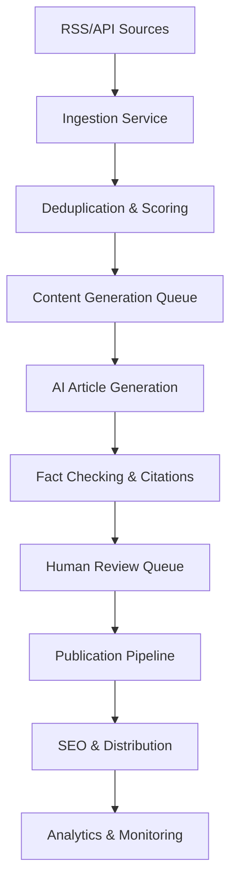

# System Architecture & Technical Specifications

**Document Version:** 1.0  
**Date:** September 6, 2025  
**Project:** AI Newsroom (ainewsroom.news)  

## System Overview

AI Newsroom is a production-grade autonomous news aggregation and publishing platform designed to deliver high-quality AI/tech journalism with human oversight. The system follows a comprehensive pipeline: **data ingestion** → **ranking & deduplication** → **content generation** → **fact-checking** → **human review** → **publishing** → **distribution** → **analytics**.

### Core Pipeline Architecture



## Technology Stack

### Web Application Layer
- **Framework:** Next.js 15 with App Router¹ (latest version as of 2025)
- **Language:** TypeScript (strict mode)
- **Styling:** Tailwind CSS + shadcn/ui components
- **Content:** MDX support for rich article formatting
- **Rendering:** React Server Components (RSC) with selective client components

### Backend Infrastructure
- **API Layer:** Next.js Route Handlers + Server Actions²
- **Database:** PostgreSQL 16+ with Prisma ORM
- **Queue System:** BullMQ with Redis for job processing
- **Search Engine:** Meilisearch for full-text search and filtering
- **Session Management:** NextAuth.js v5 (Auth.js) for authentication

### AI & Content Processing
- **LLM Gateway:** OpenRouter unified API for model routing
- **Content Pipeline:** Multi-stage generation with source grounding
- **Fact Checking:** Automated claim-to-source mapping with confidence scoring
- **Citation Engine:** Real-time source attribution and link validation

### Data Ingestion Sources
- **RSS Feeds:** Validated AI/ML news sources with robots.txt compliance
- **APIs:** Reddit API (PRAW), Hacker News API, arXiv API (cs.AI/cs.CL/cs.LG)
- **YouTube:** Official YouTube Data API v3 for channel monitoring
- **Content Extraction:** Readability.js for clean text extraction

### Infrastructure & Deployment
- **Platform:** ARM64 Ubuntu 24.04 VPS
- **Containerization:** Docker + Docker Compose with multi-arch builds
- **Reverse Proxy:** Caddy 2.x with automatic HTTPS and HTTP/3 support
- **CDN:** AWS CloudFront with S3 origin
- **Email:** Amazon SES with verified domain
- **Monitoring:** OpenTelemetry traces, structured logging, health checks

### SEO & Performance
- **Structured Data:** JSON-LD NewsArticle schema³ with complete metadata
- **Sitemaps:** XML sitemap + Google News sitemap (48-hour window, 1000 items max)⁴
- **Performance:** Core Web Vitals optimization, image optimization, prefetching
- **Meta Tags:** Open Graph, Twitter Cards, canonical URLs

## Data Architecture

### Core Entities (ERD)

```sql
-- Articles lifecycle and content management
articles (
  id uuid PRIMARY KEY,
  title varchar(200) NOT NULL,
  slug varchar(200) UNIQUE NOT NULL,
  content text,
  excerpt text,
  status article_status NOT NULL DEFAULT 'draft',
  score decimal(3,2),
  published_at timestamp,
  created_at timestamp DEFAULT now(),
  author_id uuid REFERENCES users(id),
  source_map jsonb, -- claim-to-source mappings
  seo_data jsonb,   -- meta title, description, etc.
  analytics jsonb   -- view counts, engagement metrics
);

-- Source content from external APIs
sources (
  id uuid PRIMARY KEY,
  url varchar(500) UNIQUE NOT NULL,
  title varchar(300),
  content text,
  source_type source_type NOT NULL, -- 'rss', 'reddit', 'hn', 'arxiv', 'youtube'
  source_name varchar(100),
  published_at timestamp,
  ingested_at timestamp DEFAULT now(),
  dedup_hash varchar(64), -- MinHash for deduplication
  raw_data jsonb         -- original API response
);

-- User management and RBAC
users (
  id uuid PRIMARY KEY,
  email varchar(255) UNIQUE NOT NULL,
  name varchar(100),
  role user_role NOT NULL DEFAULT 'reviewer', -- 'admin', 'editor', 'reviewer'
  created_at timestamp DEFAULT now(),
  last_login timestamp
);

-- Job queue and workflow tracking
jobs (
  id uuid PRIMARY KEY,
  type job_type NOT NULL, -- 'ingest', 'generate', 'publish', 'analyze'
  payload jsonb,
  status job_status DEFAULT 'pending',
  attempts integer DEFAULT 0,
  scheduled_at timestamp,
  completed_at timestamp,
  error_message text
);
```

### Queue Topics & State Machines

**Job Types:**
- `content.ingest` - RSS/API fetching with deduplication
- `content.generate` - AI article generation pipeline
- `content.review` - Human review assignment
- `content.publish` - Final publication and SEO
- `analytics.process` - Metrics aggregation

**Article State Machine:**
```
source_detected → ingested → scored → assigned → generated → 
fact_checked → review_pending → approved/rejected → published → analyzed
```

## AI Content Generation Pipeline

### Multi-Stage Generation Process

1. **Outline Generation**
   - Extract key points from source materials
   - Generate article structure with planned sections
   - Identify required citations and fact-checking needs

2. **Section-by-Section Drafting**
   - Generate content with source grounding for each section
   - Maintain citation trail with confidence scores
   - Apply editorial style guide consistently

3. **Consistency & Quality Pass**
   - Remove contradictions between sections
   - Unify writing style and tone
   - Add internal crosslinks to related articles
   - Validate citation accuracy

4. **SEO & Social Optimization**
   - Generate SEO-optimized title and meta description
   - Create pull-quotes and article summaries
   - Generate social media copy variants
   - Create JSON-LD structured data

### Citation & Fact-Checking Engine

```javascript
// Source mapping structure stored per article
{
  "claims": [
    {
      "id": "claim_001",
      "text": "OpenAI released GPT-5 with 10T parameters",
      "sources": [
        {
          "url": "https://openai.com/news/gpt-5-release",
          "confidence": 0.95,
          "quote": "GPT-5 features 10 trillion parameters...",
          "accessed_at": "2025-09-06T14:30:00Z"
        }
      ],
      "verification_status": "verified"
    }
  ],
  "source_summary": {
    "primary_sources": 3,
    "secondary_sources": 2,
    "confidence_average": 0.89
  }
}
```

## Security & Compliance

### Security Measures
- **Content Security Policy (CSP)** with strict nonce-based script execution
- **Rate Limiting:** Redis-based with sliding window (100 req/min per IP)
- **Input Validation:** Zod schemas for all API inputs and form data
- **SSRF Protection:** Allowlist-based URL fetching with timeout limits
- **Secret Management:** Environment variables only, no hardcoded credentials
- **Dependency Scanning:** Automated vulnerability checks in CI/CD

### Privacy & GDPR Compliance
- **Consent Management:** Two-click embeds for YouTube (privacy-enhanced mode)⁵
- **Data Minimization:** Store only necessary user data
- **Right to be Forgotten:** User data deletion endpoints
- **Cookie Policy:** Essential cookies only, analytics opt-in

### Legal Safeguards
- **Fair Use Compliance:** Quote limits (2-3 sentences max), prominent attribution
- **Embed Policy:** Official iframe embeds only, no content rehosting
- **Source Licensing:** Automated checks for permissible use
- **Takedown Process:** DMCA-compliant content removal workflow

## Observability & Monitoring

### Telemetry Stack
- **Distributed Tracing:** OpenTelemetry with Jaeger backend
- **Structured Logging:** Winston with JSON format, log levels per environment
- **Error Tracking:** Sentry integration (planned for V2)
- **Health Checks:** Kubernetes-style liveness/readiness probes

### Key Metrics
- **Pipeline Metrics:** Ingestion rate, generation latency, publish frequency
- **Quality Metrics:** Citation coverage, fact-check confidence, human approval rate
- **Performance Metrics:** Core Web Vitals, API response times, cache hit rates
- **Business Metrics:** Article views, time on page, social shares, newsletter signups

## Scaling Architecture

### Horizontal Scaling Path
1. **Phase 1 (Current):** Single VPS with Docker Compose
2. **Phase 2:** Multi-container deployment with load balancing
3. **Phase 3:** Kubernetes cluster with auto-scaling
4. **Phase 4:** Microservices architecture with event sourcing

### Performance Optimizations
- **Database:** Read replicas, connection pooling, query optimization
- **Caching:** Redis for session/API cache, CDN for static assets
- **Images:** WebP/AVIF conversion, responsive sizing, lazy loading
- **Content:** Static generation where possible, ISR for dynamic content

## Cost Estimates & Budget Management

### Monthly Operating Costs (Estimated)
- **VPS Hosting:** $50-100/month (ARM64 instance)
- **AI/LLM Usage:** $50/month (OpenRouter budget cap)
- **AWS Services:** $20-40/month (SES, S3, CloudFront)
- **Domain & DNS:** $15/month (Cloudflare Pro)
- **Monitoring:** $0-25/month (self-hosted initially)
- **Total:** ~$135-230/month

### Cost Controls
- **Model Fallbacks:** GPT-4o → Claude 3.5 → Llama 3.1 (free tier)
- **Usage Monitoring:** Real-time budget tracking with auto-cutoffs
- **Resource Optimization:** Efficient prompting, response caching, model selection

---

## Bibliography & Citations

1. **Next.js App Router Documentation** - Next.js 15 official documentation on App Router features and API routes. Retrieved from: https://nextjs.org/blog/next-15 (Accessed: September 6, 2025)

2. **Building APIs with Next.js** - Official guide comparing App Router vs Pages Router for API development. Retrieved from: https://nextjs.org/blog/building-apis-with-nextjs (Accessed: September 6, 2025)

3. **JSON-LD NewsArticle Schema** - Structured data implementation guide for news articles. Retrieved from: https://jsonld.com/news-article/ (Accessed: September 6, 2025)

4. **Google News Sitemap Requirements** - Technical specifications for Google News sitemaps including 48-hour window and 1000-item limits. Retrieved from: https://aioseo.com/features/google-news-sitemaps/ (Accessed: September 6, 2025)

5. **YouTube Privacy-Enhanced Mode** - GDPR compliance guide for YouTube embeds using nocookie domain. Retrieved from: https://www.myagileprivacy.com/en/how-to-insert-youtube-videos-in-compliance-with-gdpr/ (Accessed: September 6, 2025)

6. **Web Scraping Legal Guidelines** - Legal framework for ethical web scraping and API usage. Retrieved from: https://www.scraperapi.com/web-scraping/is-web-scraping-legal/ (Accessed: September 6, 2025)

---

**Note:** This architecture is designed for ARM64 compatibility and production deployment on Ubuntu 24.04. All container images will be built with `linux/arm64` architecture, and Docker Buildx will be used for multi-architecture builds when necessary.
